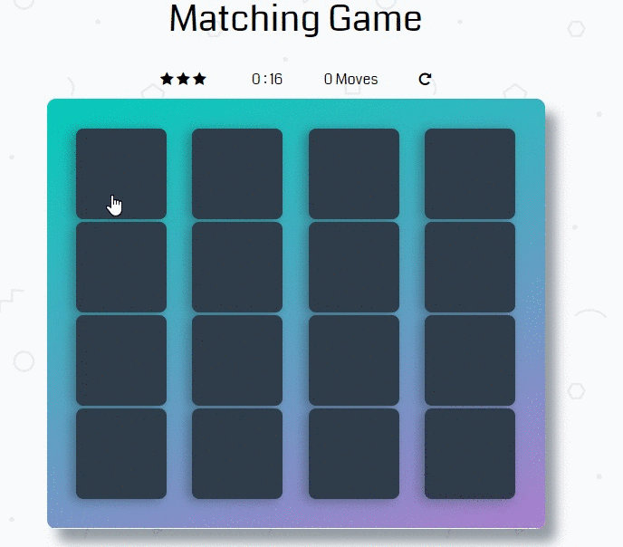

# Memory Game Project - Udacity Front-End Web Developer Nanodegree Project.

## Live Demo

 https://yulya-yu.github.io/fend-project-memory-game/

## Instructions

To play the game do the following:

1) Click and match the cards
2) Matching cards within a certain time limit will grant you a certain number of stars
3) You always can restart the game with Restart Button

## Project Specifications

### Game Behavior
* Game Logic - matching game shuffles the cards randomly. Player wins when all the cards are matched successfully.
* Restart Button - a button that resets game board, timer and rating.
* Timer - timer starts when the game begins and stops when it ends.
* Move Counter - displays current number of moves made by the player.
* Star Rating - 	memory game has star rating that reflects the player's performance. The amount of stars earned depends on how quickly the player finish the game and on how many moves are done.
* Congratulations Modal - when the player wins the game, a congratulations modal appears and asks if the player wants to play again. It also tells the player how much time it took to win the game, and what the star rating was.

## Contributing

For details, check out [CONTRIBUTING.md](CONTRIBUTING.md).

## Code Dependencies
* jQuery.js - fast, small, and feature-rich JavaScript library.
* animate.css - a bunch of cool, fun, and cross-browser animations.
* sweetalert.js - A beautiful, responsive, highly customizable and accessible (WAI-ARIA) replacement for JavaScript's popup boxes.
